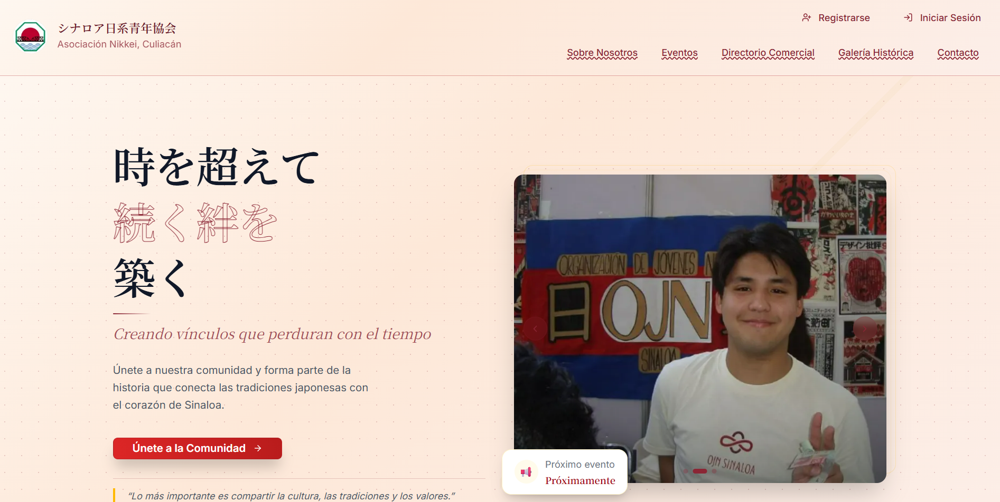
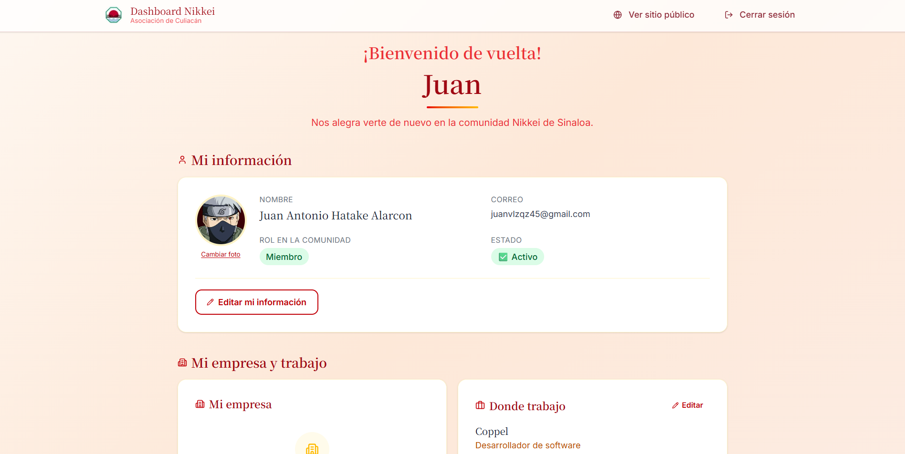
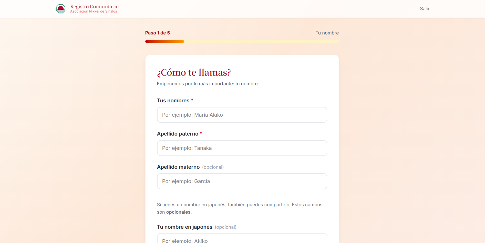
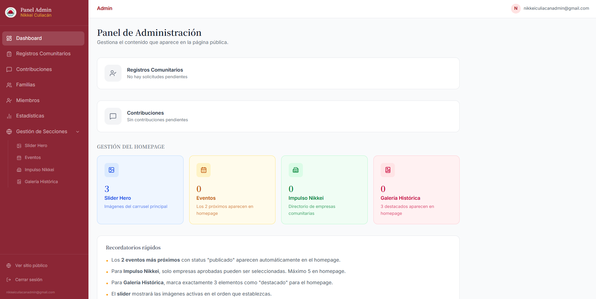

# Nikkei Sistema — Community Management Platform

<p align="center">
  
  
  
  
  
  
</p>

> Full-stack community platform built for the Japanese-descendant association of Culiacán, Sinaloa, México — currently in production at [nikkeiculiacan.com](https://nikkeiculiacan.com). Handles member registration, genealogy trees, event management, business directory, historical gallery, and a complete admin dashboard with community analytics.

---

## 🌐 Live Demo

| Resource | URL |
|----------|-----|
| Public site | [nikkeiculiacan.com](https://nikkeiculiacan.com) |
| Admin panel | [nikkeiculiacan.com/admin](https://nikkeiculiacan.com/admin) |
| API | [nikkei-sistema-production.up.railway.app](https://nikkei-sistema-production.up.railway.app) |

> **This is a real production system** used by an actual organization — not a demo project.

---

## Screenshots

### Landing Page


### Member Dashboard


### Admin Statistics


### Member Registry


### Event Management


### Admin Panel


---

## Architecture

Decoupled three-layer architecture with independent frontend, backend, and database deployments:

```
nikkei-sistema/
├── frontend/                  # Next.js 16 — deployed on Vercel
│   ├── src/
│   │   ├── app/               # App Router pages
│   │   │   ├── admin/         # Admin panel (protected)
│   │   │   ├── dashboard/     # Member dashboard (protected)
│   │   │   ├── eventos/       # Public events
│   │   │   ├── directorio/    # Business directory
│   │   │   ├── galeria/       # Historical gallery
│   │   │   ├── register/      # Multi-step member registration
│   │   │   ├── verify-email/  # Email verification
│   │   │   └── reset-password/
│   │   ├── components/        # Shared UI components
│   │   └── lib/               # API clients, types, utilities
│   └── middleware.ts           # Route protection
│
└── backend/                   # Go REST API — deployed on Railway
    ├── cmd/main.go             # Server entry point, CORS, rate limiting
    └── internal/
        ├── handlers/           # Gin HTTP handlers
        ├── models/             # GORM models
        ├── services/           # Business logic (auth, email)
        └── database/           # Migrations, seeders, connection
```

### Frontend — Next.js 16 + TypeScript
App Router with server/client component separation. Key decisions:

- **Middleware-based route protection** for `/admin`, `/dashboard`, and `/registro-comunitario`
- **`Suspense` wrappers** around all `useSearchParams` hooks — required for Next.js production builds (split into `page.tsx` + `_Form.tsx` pattern)
- **Custom SVG charts** instead of chart libraries — full control, zero dependencies
- **Dynamic CORS** via `ALLOWED_ORIGINS` env var on the API

### Backend — Go + Gin + GORM
REST API with clean handler/service separation. Key decisions:

- **Go** chosen for performance and low memory footprint on Railway's free tier
- **GORM** with explicit `json` struct tags — required for correct serialization
- **`int64` → `Number()` coercion** on the TypeScript side to prevent NaN from JSON large integers
- **Rate limiting** at 30 req/s per IP using `golang.org/x/time/rate`
- **Raw SQL `UPDATE`** for seeder date manipulation — GORM ignores `created_at` in normal updates

---

## Features

### Public Site
| Section | Description |
|---------|-------------|
| Landing page | Configurable hero slider, upcoming events, business directory preview, historical gallery |
| Events | Full listing with past/upcoming tabs, attendance registration with duplicate prevention |
| Impulso Nikkei | Business directory with search and category filters |
| Historical Gallery | Photo archive with timeline and grid view |
| About Us | Community history and testimonials |
| Contact | Direct message form — routes to admin email via Resend |

### Member Area (Dashboard)
| Feature | Description |
|---------|-------------|
| Registration | 5-step wizard: name, generation, family, personal data, preferences |
| Profile | Edit contact info, update profile photo (Cloudinary) |
| My Business | Register/edit business (re-approval flow on edit) |
| Genealogy Tree | Add family members, confirm proposed relations |
| Contributions | Send messages, stories, or donations to admin |

### Admin Panel
| Module | Description |
|--------|-------------|
| Dashboard | KPIs, pending alerts, content summary |
| Community Registrations | Approve/reject with family validation and filters |
| Members | Full list with search, generation/status filters, detailed profile modal |
| Statistics | 13+ charts: generational distribution, gender, age, Japanese level, city, event analytics, business stats |
| Slider | Upload and order hero images |
| Events | Full CRUD with status flow: draft → published → ongoing → finished → cancelled |
| Impulso Nikkei | Approve business listings, select up to 5 for homepage |
| Historical Gallery | Upload photos, tag 3 as featured for homepage |
| Contributions | Review and manage member submissions |
| Family Trees | View genealogical connections per family |

---

## Security

- **JWT authentication** — 24h expiry, role-based access (member vs admin)
- **bcrypt** password hashing
- **Email verification** on registration + password reset via secure token (1h expiry)
- **Rate limiting** — 30 req/s per IP
- **CORS** — only the production domain is whitelisted via env var
- **HTTPS** enforced end-to-end
- **SQL injection prevention** — parameterized queries via GORM
- **HTTP security headers** — `X-Frame-Options`, `CSP`, `X-Content-Type-Options`
- **SSL** on database connection in production
- **Seed endpoint** disabled in production via `APP_ENV` check
- **Sensitive credentials** in environment variables only — never in code

---

## Tech Stack

| Layer | Technology | Purpose |
|-------|-----------|---------|
| Frontend | Next.js 16 + App Router | SSR/SSG, file-based routing |
| Frontend | TypeScript | Static typing |
| Frontend | Tailwind CSS | Styling |
| Frontend | Custom SVG | Charts and data visualization |
| Backend | Go 1.25 + Gin | REST API |
| Backend | GORM | ORM + migrations |
| Database | PostgreSQL | Data persistence |
| Auth | JWT + bcrypt | Token-based auth |
| Email | Resend API | Transactional email (verification, reset) |
| Images | Cloudinary | Photo uploads and storage |
| Hosting (frontend) | Vercel | Free tier, auto-deploy from GitHub |
| Hosting (backend + DB) | Railway | ~$5 USD/month |
| Domain | Porkbun | nikkeiculiacan.com — ~$12/year |

---

## Running Locally

### Prerequisites
- Node.js 18+
- Go 1.25+
- PostgreSQL 16

### Frontend

```bash
cd frontend
npm install
cp .env.example .env.local
# Set NEXT_PUBLIC_API_URL=http://localhost:8080
npm run dev
```

### Backend

```bash
cd backend
cp .env.example .env
# Configure DB_HOST, DB_USER, DB_PASSWORD, DB_NAME, JWT_SECRET, RESEND_API_KEY
go mod download
go run cmd/main.go
```

### Environment Variables

**Backend (`.env`)**
```env
APP_ENV=development
PORT=8080
DB_HOST=localhost
DB_PORT=5432
DB_USER=postgres
DB_PASSWORD=yourpassword
DB_NAME=nikkei_db
DB_SSL_MODE=disable
JWT_SECRET=your-64-char-hex-secret
JWT_EXPIRES_IN=24h
RESEND_API_KEY=re_xxxxxxxx
SMTP_TO=admin@yourdomain.com
APP_URL=http://localhost:3000
ALLOWED_ORIGINS=http://localhost:3000
ADMIN_EMAIL=admin@yourdomain.com
ADMIN_PASSWORD=yourpassword
```

**Frontend (`.env.local`)**
```env
NEXT_PUBLIC_API_URL=http://localhost:8080
NEXT_PUBLIC_APP_NAME=Asociación Nikkei de Culiacán
```

---

## Data Model (simplified)

```
users                    personas (community members)
─────                    ───────────────────────────
id_user (PK)             id_persona (PK)
email                    nombre / apellido_paterno / apellido_materno
password_hash            nombre_japones
role (admin|member)      generacion (Issei→Gosei)
email_verified           id_familia (FK)
verification_token       id_empresa_empleadora (FK)
reset_token              fecha_nacimiento / genero / ciudad
id_persona (FK) ─────────►

familias                 eventos
────────                 ───────
id_familia (PK)          id_evento (PK)
nombre_familia           titulo / tipo / fecha_inicio
pais_origen              status (draft|published|ongoing|finished)
                         id_organizador (FK)

empresas                 participacion_eventos
────────                 ─────────────────────
id_empresa (PK)          id_persona (FK)
nombre / giro            id_evento (FK)
id_propietario (FK)      UNIQUE(id_persona, id_evento)
status (pending|approved)

genealogia
──────────
id_persona (FK)
id_pariente (FK)
tipo_relacion
UNIQUE(id_persona, id_pariente, tipo_relacion)
CHECK(id_persona != id_pariente)
```

---

## Author

**Juan Antonio Velázquez Alarcón**  
Computer Systems Engineering — Instituto Tecnológico de Culiacán

<p>
  <a href="https://github.com/JuanvlzqzTec">
    
  </a>
</p>

---

<div align="center">
  <sub>根 · 絆 · 未来 — Raíces · Lazos · Futuro</sub>
</div>